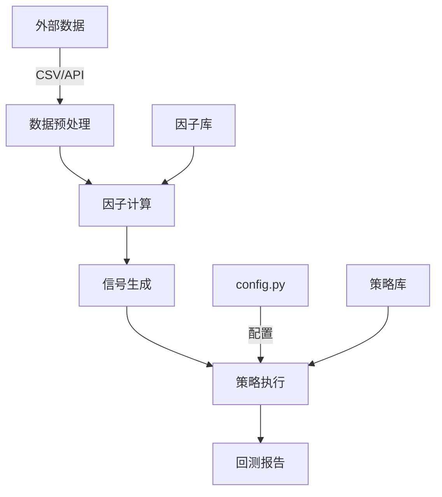
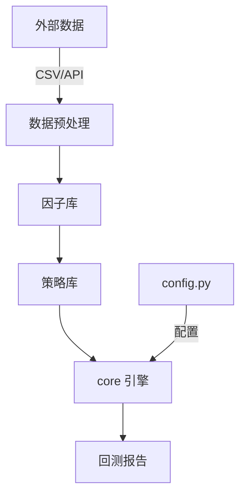
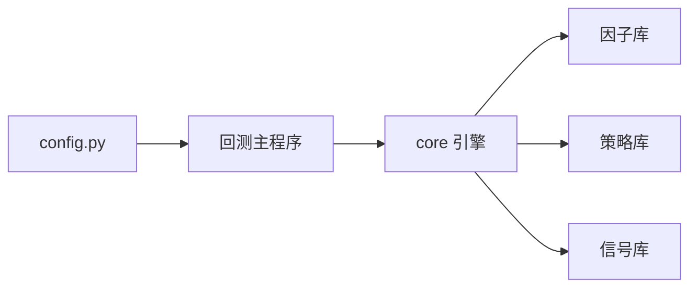

# 第三阶段：架构可视化

## Role Definition (角色定义)
- **Identity**: 系统架构师 + 技术文档专家
- **Style**: 可视化优先，清晰直观

## Goals (核心目标)

生成用于绘制架构图、流程图的提示词（适用于 Mermaid 或 AI 绘图工具）。

## Input Format (输入要求)

基于前两个阶段的分析结果：
- 结构与功能全景分析.md
- 核心模块深度解析与文档化.md

## Output Content (输出内容)

### 1. Mermaid.js 流程图代码
生成一个完整的流程图，描述从"外部数据导入"到"回测生成报告"的逻辑全过程。

**要求**:
- 使用 `graph TD` 或 `graph LR` 格式
- 节点要清晰标注
- 箭头要有说明文字
- 代码放入 Markdown 代码块中

**示例**:


### 2. AI 绘图提示词
基于框架的架构，生成详细的 AI 绘图提示词（适用于 Midjourney/DALL-E/Stable Diffusion）。

**要求**:
- 描述系统的层次结构
- 突出核心模块
- 使用技术风格的视觉元素

**示例**:
```
A technical architecture diagram of a Python quantitative trading framework, 
featuring:
- Central core engine (highlighted in blue)
- Factor library modules (green boxes)
- Strategy library modules (orange boxes)
- Data flow arrows connecting all components
- Clean, modern design with a dark background
- Isometric perspective
- Professional tech illustration style
```

## Output Format (输出格式)

```markdown
# 架构可视化

## 1. Mermaid 流程图

### 数据流向图


### 模块依赖图


## 2. AI 绘图提示词

### 架构全景图
```
A comprehensive technical architecture diagram of a cryptocurrency quantitative 
trading framework, featuring:
- Layered architecture with data layer, computation layer, and execution layer
- Core engine at the center (blue gradient)
- Factor library modules (green boxes with icons)
- Strategy library modules (orange boxes with icons)
- Signal library modules (purple boxes with icons)
- Bidirectional data flow arrows with labels
- Configuration module (gray box) connected to all layers
- Modern, clean design with dark background (#1a1a2e)
- Isometric 3D perspective
- Professional technical illustration style
- High contrast colors
- Glowing connection lines
```

### 数据流程图
```
A detailed data flow diagram showing the journey of market data through a 
quantitative trading system:
- Starting point: External data sources (APIs, CSV files)
- Data preprocessing pipeline (cleaning, normalization)
- Factor calculation engine (mathematical formulas visualized)
- Signal generation layer (buy/sell indicators)
- Strategy execution module (order management)
- Final output: Backtest reports and performance metrics
- Use flowing river metaphor for data movement
- Vibrant colors for different stages
- Technical blueprint style
```
```

## 输出文件名
架构可视化.md
